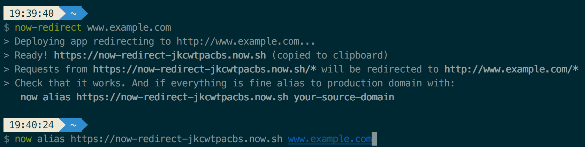

# now-redirect

CLI tool based on [𝚫 now](https://zeit.co/now). It is intended to setup redirects to canonical urls.

## Installation

```
npm install -g now now-redirect
```

## Usage



Given you decided that https://www.example.com will be canonical address of your site. You will need to setup redirect from https://example.com for those users who prefer shorter urls. To accomplish this run from any folder:

```
now-redirect www.example.com
```

Check that freshly deployed app works as expected. And if it's ok - alias to production domain.

```
now alias deploymentId example.com
```
